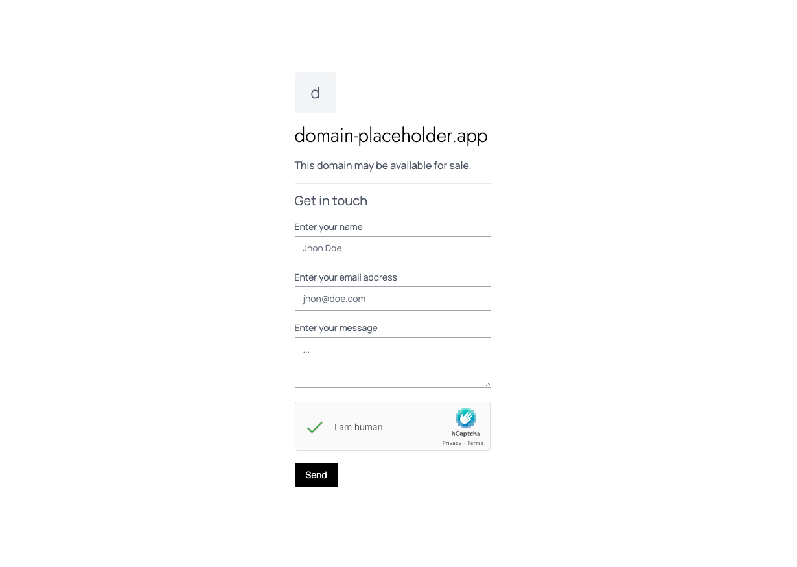

# Domain Placeholder

A Simple Next.JS app which can be used as a domain placeholder.

## Environment Variables

To run this project, you will need to add the following environment variables to your .env file

`NEXT_PUBLIC_HCAPTCHA_SITE_KEY` - HCaptch Site Key

`HCAPTCHA_SECRET` - HCaptcha Secrect Key

`ACCESS_KEY` - Web3Forms Access Key

## Demo

The demo is available at https://domain-placeholder.vercel.app/

## Used By

This project is used by :

-   www.minnanjhal.com

## License

[MIT](https://choosealicense.com/licenses/mit/)
